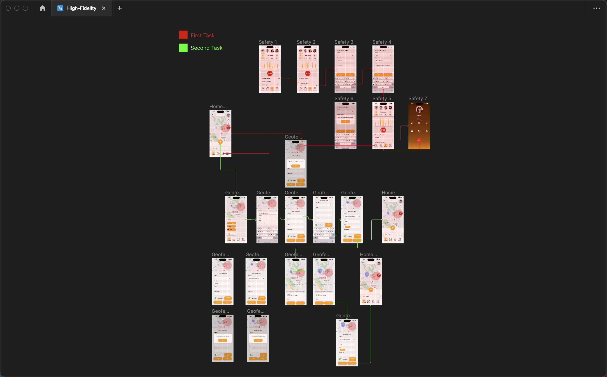
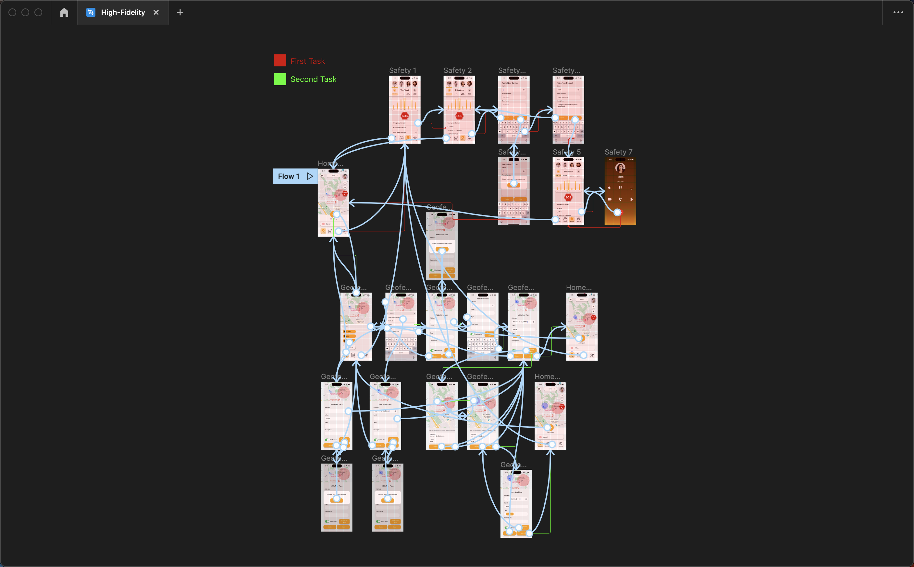

# DH110 Assignment 07: High Fidelity Prototype
### Yongsen Huang - Spring 2023

## Introduction
This interactive prototype for TribeTrack aims to improve the visualization and interactivity of information within a limited screen size, compared to the low-fidelity prototype created previously. It also validates the interaction flow, branching out based on the user's choices. In this high-fidelity interactive prototype, I will ask the user to perform the same two tasks as before, but with a better-designed interface and layout. My intention is to enable the user to easily navigate through all operations without encountering any difficulties.

## Two Desgined Tasks
1. During the testing of the high-fidelity prototype of TribeTrack, the tester was asked to perform two tasks. The first task involved setting up an emergency call to their mom's phone number through the safety page. To accomplish this, the tester navigated to the "Location" page from the homepage, where they were able to access the emergency call function. After completing the call to their mom, they returned to the homepage.
2. The second task required the tester to set up a new geofence from the homepage, specifically adding a new place and inputting it as their home address. The tester was able to do this with ease, navigating through the interface and customizing the geofence size and name as needed.

## Wireflow and Interaction Prototype
[Figma Link](https://www.figma.com/file/LUVFanPDicMw6mCunnuDFt/High-Fidelity?type=design&node-id=0%3A1&t=jlLC4x4jRhguLyDq-1)

<iframe style="border: 1px solid rgba(0, 0, 0, 0.1);" width="800" height="450" src="https://www.figma.com/embed?embed_host=share&url=https%3A%2F%2Fwww.figma.com%2Ffile%2FLUVFanPDicMw6mCunnuDFt%2FHigh-Fidelity%3Ftype%3Ddesign%26node-id%3D0%253A1%26t%3DjlLC4x4jRhguLyDq-1" allowfullscreen></iframe>
